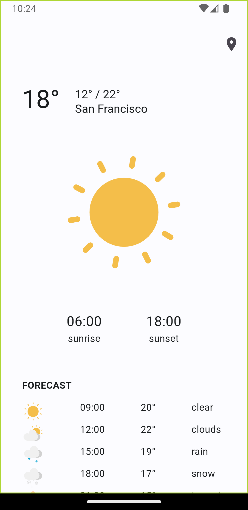

# Simple Weather App

This Flutter-based application offers a convenient way to access weather information with a user-friendly interface.

## Getting Started

To use the application, follow these steps:

1. Create an account on [OpenWeatherMap](https://openweathermap.org/) to obtain your unique API key. Find your API key [here](https://home.openweathermap.org/api_keys).
2. Insert the obtained API key into the designated field within [lib/data/api_key_secret.dart](lib/data/api_key_secret.dart).
3. Execute the following commands to build and run the project:

    ```bash
    flutter pub get
    flutter run
    ```

## Screenshots
<div style="display: flex; justify-content: space-around;">
  
  
</div>

## Supported Devices

The application has been tested on the Android platform. Customization for usage on other platforms may be required.

## Credits

The warning Lottie animation was crafted by [Ashleyy🍙](https://lottiefiles.com/ashleycmy).<br>
All other Lottie animations were created by [Tlife](https://lottiefiles.com/rkyy33389gmail.com).

Feel free to contribute or report issues! 😉
