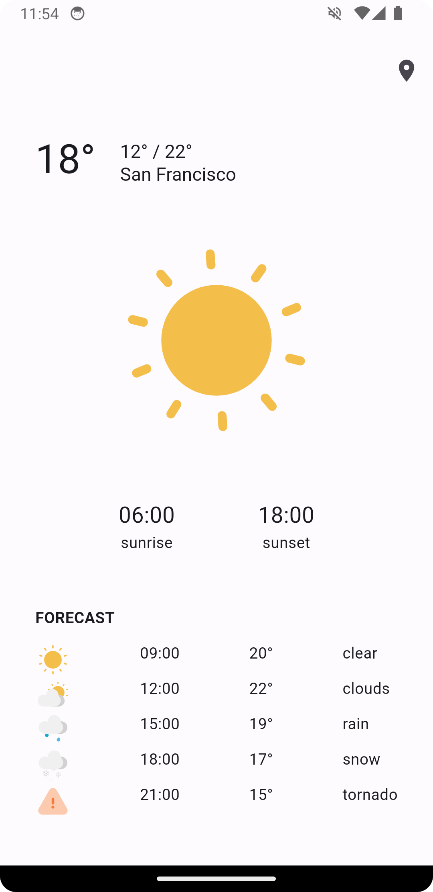
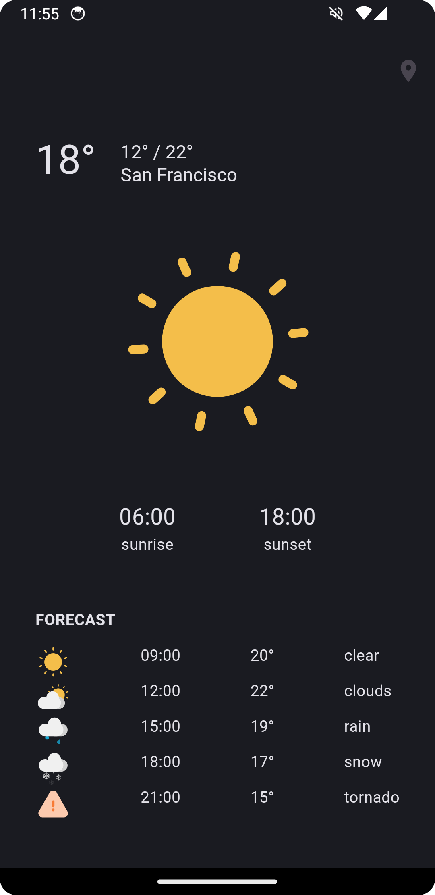

# Features
- Animated weather at your location
- Sunrise and sunset times
- 12h forecast data in 3h steps

# Preview
<div style="display: flex; justify-content: space-around;">
  
  
</div>

# Getting Started

To use the application, follow these steps:

1. Create an account on [OpenWeatherMap](https://openweathermap.org/) to obtain your unique API key. Find your API key [here](https://home.openweathermap.org/api_keys).
2. Insert the obtained API key into the designated field within [lib/data/api_key_secret.dart](lib/data/api_key_secret.dart).
3. Execute the following commands to build and run the project:

    ```bash
    flutter pub get
    ```
    ```bash
    flutter run
    ```

# Credits
The warning Lottie animation was crafted by [Ashleyy🍙](https://lottiefiles.com/ashleycmy).<br>
All other Lottie animations were created by [Tlife](https://lottiefiles.com/rkyy33389gmail.com).
